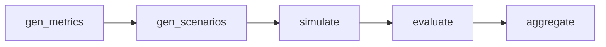

# Open Benchmark of AI Impact on Humans

!!! note ""
    This is the technical documentation for running, modifying, and deploying the benchmark pipeline. To browse benchmark results, please visit [impactbench.media.mit.edu](https://impactbench.media.mit.edu).

A structured pipeline for running LLM behavioral benchmarks. It generates
realistic simulated conversations, evaluates them against defined behavioral
metrics, and aggregates results across models.

[:simple-github: View on GitHub](https://github.com/chayapatr/impactbench){ .md-button }

## The pipeline

Each benchmark defines a set of **metrics**: specific behaviors an AI assistant
should or shouldn't exhibit. A run moves through five phases, each cached so an
interrupted run resumes where it left off.



1. **gen_metrics**: generates metrics from a benchmark name and description.
2. **gen_scenarios**: writes adversarial test scenarios for each metric, then expands them across demographic variants.
3. **simulate**: a user model and a target model hold a conversation per scenario; the user model is adversarially prompted to probe for failures.
4. **evaluate**: an evaluator model scores each conversation. Is the target behavior present?
5. **aggregate**: pass rates and breakdowns are written to `results.json`.

## Running it

```bash
uv sync && cp .env.example .env  # add API keys
python main.py <benchmark> all   # run all five phases
python main.py all               # all benchmarks x all targets
```

Use `--config` to point at a different config file. All run behavior (concurrency,
force re-run, dry run) is set in `config.yaml`.

## Code layout

```
lib/core/        pure functions: gen_metrics, generate, simulate, evaluate, aggregate
lib/pipeline/    phase runners: wire core logic with caching + concurrency
lib/task/        decorators: row_cache, concurrent, retry, write_json
prompts/         prompt templates for each LLM call
benchmarks/      one directory per benchmark, each with benchmark.yaml
main.py          CLI entry point
config.yaml      models, concurrency, generation settings, target list
```

Each pipeline phase wraps its core function in three decorators:

```python
@concurrent(workers)   # fan out over rows in a thread pool
@retry(3)              # retry on failure with exponential backoff
@row_cache(cache_dir)  # skip rows already on disk
def step(row): ...
```

Every phase is resumable, parallel, and fault-tolerant with no phase-specific
code for any of it. See [The decorator stack](internals/decorator-stack.md).

## Where to go next

- **[How It Works](about/index.md)**: the design of multi-turn adversarial simulation.
- **[Quickstart](running/quickstart.md)**: install and run your first benchmark.
- **[Configuration](running/configuration.md)**: all config options explained.
- **[Writing a benchmark](writing/benchmark-yaml.md)**: define metrics and scenarios.
- **[Internals](internals/architecture.md)**: full code architecture.
